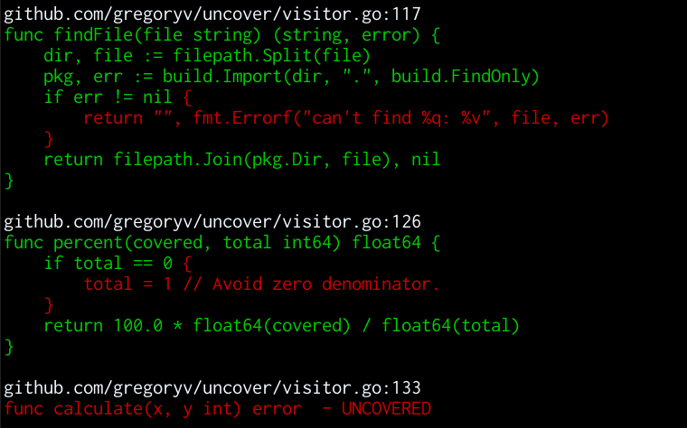

[uncover](https://godoc.org/github.com/gregoryv/uncover) - Generate coverage reports from coverprofiles

Generates colorized coverage report to stdout of uncovered funcs.
Source originates from the golang cover tool.

## Quick start

Install

    go get -u github.com/gregoryv/uncover/...

In your project test with coverage and show result

    go test -coverprofile /tmp/c.out
    uncover /tmp/c.out [FuncName]

Expect a minimum coverage

    uncover -min 80.0 /tmp/c.out
